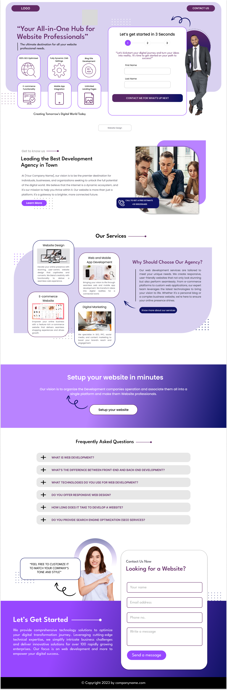

# Website Professionals Hub

A modern, responsive company landing page built from a Figma design provided by a client. This project demonstrates a pixel-perfect implementation using HTML, CSS, JavaScript, and Bootstrap.

## ✨ Features

- **Fully Responsive Design** – Looks great on all devices
- **Multi-step Contact Form** – Engaging, user-friendly form with progress indicator
- **FAQ Accordion** – Interactive frequently asked questions section
- **Service Highlights** – Visually appealing service cards and feature grid
- **Modern UI** – Clean, professional look inspired by Figma
- **Bootstrap 5 Integration** – For layout and responsive utilities

## 🚀 Demo



## 📁 Project Structure

```
index.html
Assests/
  css/
    style.css
  js/
    script.js
  images/
    ... (SVGs, PNGs, and assets)
```

## 🛠️ Technologies Used

- HTML5
- CSS3 (custom + Bootstrap 5)
- JavaScript (vanilla)
  

## 📐 Figma Design

This project was built based on a Figma design provided by the client. All layouts, colors, and assets were matched as closely as possible to the original design.

## 🖥️ Getting Started

1. **Clone the repository:**
   ```sh
   git clone https://github.com/dawood125/Company-portfolio
   cd website-professionals-hub
   ```

2. **Open `index.html` in your browser.**

   For live reload during development, you can use [Live Server](https://marketplace.visualstudio.com/items?itemName=ritwickdey.LiveServer) in VS Code.

## 🤝 Credits

- **Design:** Provided by client via Figma
- **Development:** [Dawood Ahmed](https://github.com/dawood125)

## 📄 License

This project is licensed under the [MIT License](LICENSE).

---

> Built with ❤️ using Figma, HTML, CSS, and JavaScript.
